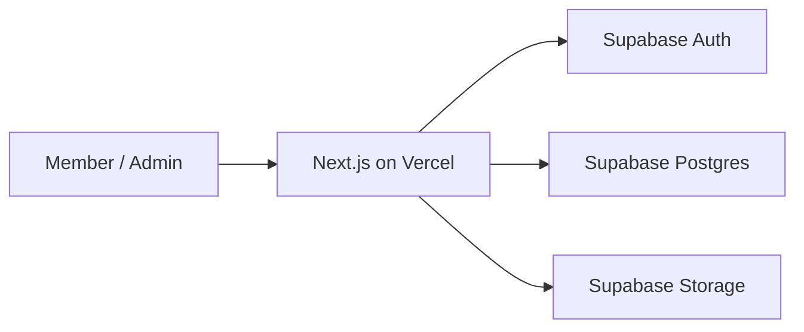

# Architecture

## 1. Why This Stack

### Next.js App Router

- 适合内容列表、详情页、管理台共存的单体 Web 应用。
- 支持 Server Components、Server Actions 和 Route Handlers，能减少前后端拆分成本。
- 和 Vercel 部署链路天然匹配。

### Supabase

- 一次性提供 Postgres、Auth 和 Storage，适合内部工具快速落地。
- RLS 适合做成员、卖家、管理员三层权限控制。
- 免费额度足够支撑社团级别 MVP 验证。

### Drizzle ORM

- 提供清晰的 schema 定义和迁移能力。
- 类型友好，适合和 TypeScript、Next.js 配合。
- 相比更重的 ORM，更适合 Vercel + Serverless 的运行方式。

### Tailwind CSS + shadcn/ui

- 适合快速搭建一致的内部工具界面。
- 可维护性好，后期容易做信息密度更高的管理台。

## 2. High-Level Architecture

## 3. Application Boundaries

### Presentation Layer

- 首页与发现页：展示已发布闲置、分类入口、筛选项和搜索。
- 详情页：展示闲置描述、图片、卖家信息、预约状态、收藏与举报入口。
- 发布与编辑页：卖家管理自己的闲置信息，支持草稿、图片删除、重排和设封面。
- 我的页面：查看我的发布、我的预约、我的收藏。
- 管理台：审核成员、审核闲置、处理举报、查看审计日志、管理分类。

### Server Layer

- 使用 Server Actions 处理已登录用户触发的数据写入。
- 使用 Route Handlers 承担管理侧接口、回调接口和必要的服务端任务。
- 所有写操作在服务端再次校验业务状态和角色权限。

### Data Layer

- 业务数据以 Postgres 为单一事实来源。
- 文件对象只在 Storage 中保存，业务表仅保存对象路径和元数据。
- 重要状态变更以审计日志补充记录。

## 4. Authentication & Authorization

### Authentication

- 支持 GitHub OAuth 登录。
- 也支持由管理员预先创建的邮箱密码账号，默认不开放公开注册。
- 初次登录后创建或补全成员资料。
- 账号只有在成员状态为 `active` 时才拥有完整功能。

### Authorization

- `member`：浏览已发布内容、发布自己的闲置、发起预约、收藏、举报。
- `admin`：具备成员权限，并可审核、下架、封禁、处理举报、管理分类、查看审计日志。
- 所有表通过 RLS 与服务端二次校验共同保护。

## 5. Core Domain Modules

- `auth`：登录、会话、角色判断、路由守卫。
- `profiles`：成员资料、成员状态、联系方式管理。
- `listings`：闲置创建、编辑、发布、状态机。
- `media`：图片上传、排序、删除、封面管理。
- `reservations`：预约申请、处理、取消、关闭，驱动 `reserved` / `completed` 状态。
- `engagement`：收藏、举报、我的预约 / 我的收藏数据视图。
- `categories`：分类显示文案、排序、启停和发布建议配置。
- `moderation`：审核、举报处理、违规说明、下架动作。
- `audit`：记录管理员和关键业务动作。

## 6. Recommended App Routes

- `/`：发现页
- `/login`：登录页
- `/items/[id]`：闲置详情
- `/publish`：发布闲置
- `/me/listings`：我的发布
- `/me/reservations`：我的预约
- `/me/favorites`：我的收藏
- `/admin/review`：审核台
- `/admin/members`：成员管理
- `/admin/audit`：审计日志
- `/admin/reports`：举报处理
- `/admin/categories`：分类管理

## 7. Environment Variables

- `NEXT_PUBLIC_SUPABASE_URL`
- `NEXT_PUBLIC_SUPABASE_ANON_KEY`
- `SUPABASE_SERVICE_ROLE_KEY`
- `POSTGRES_URL`
- `POSTGRES_URL_NON_POOLING`
- `NEXT_PUBLIC_PREVIEW_DATA_ISOLATED`（可选）

说明：

- `SUPABASE_SERVICE_ROLE_KEY` 只允许在服务端使用，不能暴露给浏览器。
- `POSTGRES_URL` 供服务端数据库访问使用。
- `POSTGRES_URL_NON_POOLING` 建议供 Drizzle migration 使用。
- `NEXT_PUBLIC_PREVIEW_DATA_ISOLATED` 仅用于前端提示 Preview 是否已完成数据隔离。

## 8. Testing Strategy

- 单元测试：覆盖表单校验、状态流转函数、权限判断和数据映射。
- 集成测试：覆盖发布、审核、预约、下架、分类配置等关键业务链路。
- 端到端测试：覆盖登录、发布闲置、管理员审核、买家预约、收藏、举报处理等主路径。

## 9. Deployment Strategy

- 主部署平台为 Vercel。
- 数据库与 Storage 由 Supabase 承载。
- 预览环境用于 UI 与业务流程验收。
- 生产环境仅在文档和 schema 变更审查通过后发布。
- 目标形态下，`Preview` 与 `Production` 应使用不同的 Supabase / Postgres 资源；如果两者仍共用同一套后端，则 Preview 只算部署隔离，不算数据隔离。
